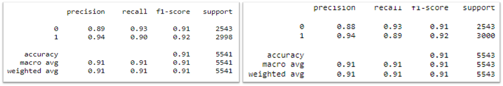
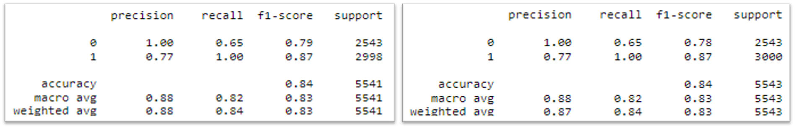
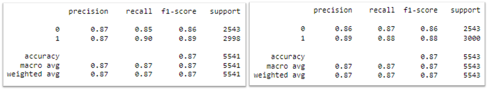
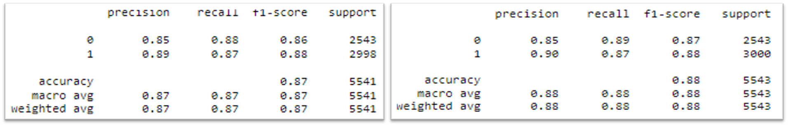
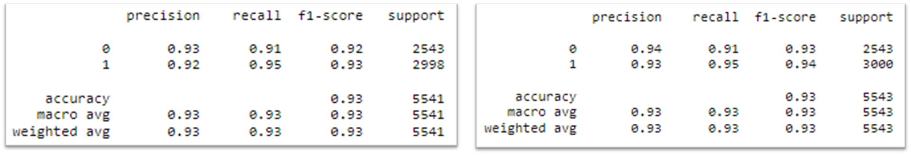
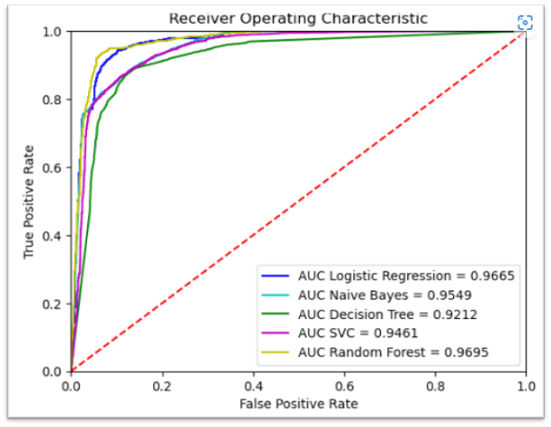

# Prediksi Customer Churn menggunakan Teknik Machine Learning

Dengan menggunakan prediksi churn, dapat mengidentifikasi customer churn sebelum customer berpindah ke perusahaan lain.
Hal ini juga dapat membantu sektor CRM (Customer Relationship Management) agar dapat mempertahankan customer, sehingga mengurangi potensi kerugian yang dialami oleh
perusahaan.

Dataset berasal dari https://www.hackerearth.com/problem/machine-learning/predict-the-churn-risk-rate-11-fb7a760d/. Dataset tersebut memiliki 36.992 record dengan 23 variabel. 
Pada project ini dilakukan data preparation, splitting data, EDA, data understanding, data preprocessing, feature engineering hingga model fitting dengan
membandingkan lima metode untuk mendapatkan metode terbaik. Pengujian dari setiap model menggunakan confusion matrix dan ROC Curve.

**1. Metode Logistic Regression**

**2. Metode Naïve Bayes**

**3. Metode Decision Tree**

**4. Metode Support Vector Machine (SVM)**

**5. Metode Random Forest**

**Hasil ROC Curve**

